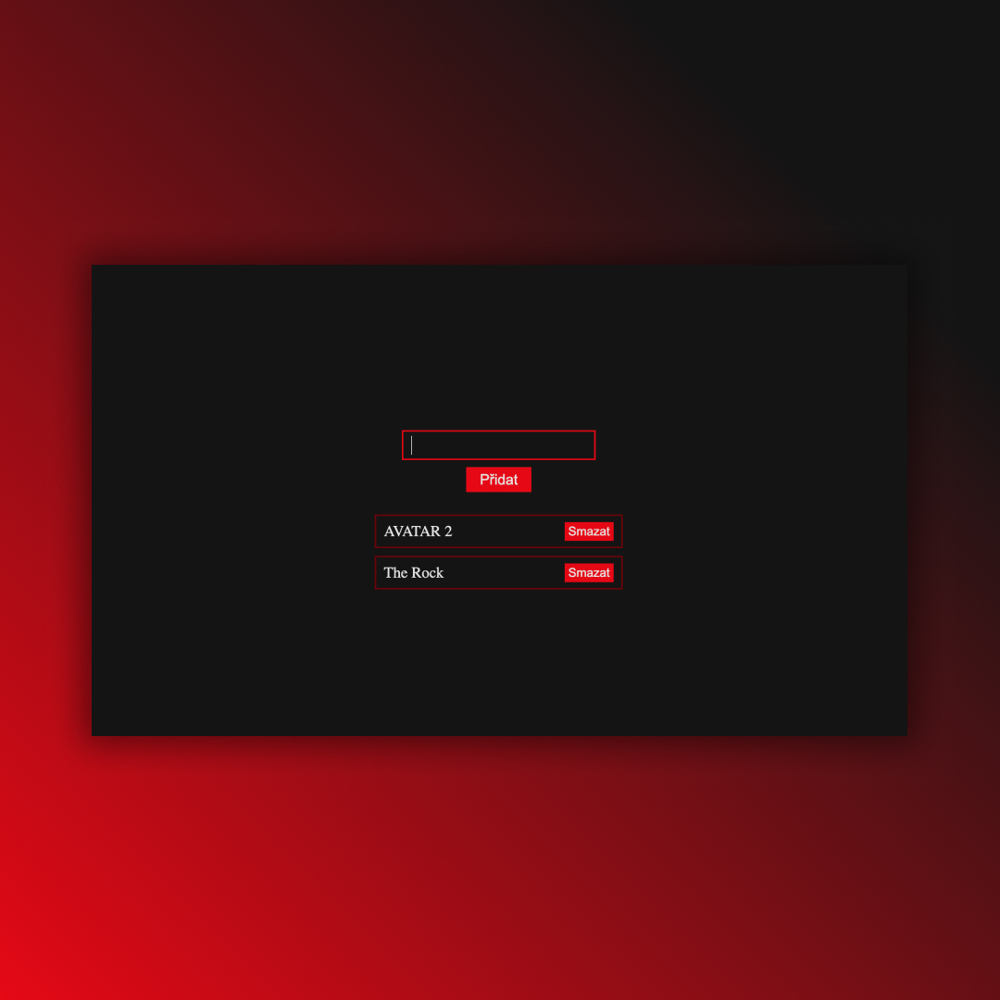

## useReducer
• useReducer is a hook in React ✅  
• Practicing useState, filter, map, form, props and destructuring ✅

## Screenshots 📱

## 💻 Tech Stack

## 🌐 Link
<a href="https://usereducer-dejvcodes.netlify.app/">useReducer</a>

## License🔐
[MIT License](LICENSE)